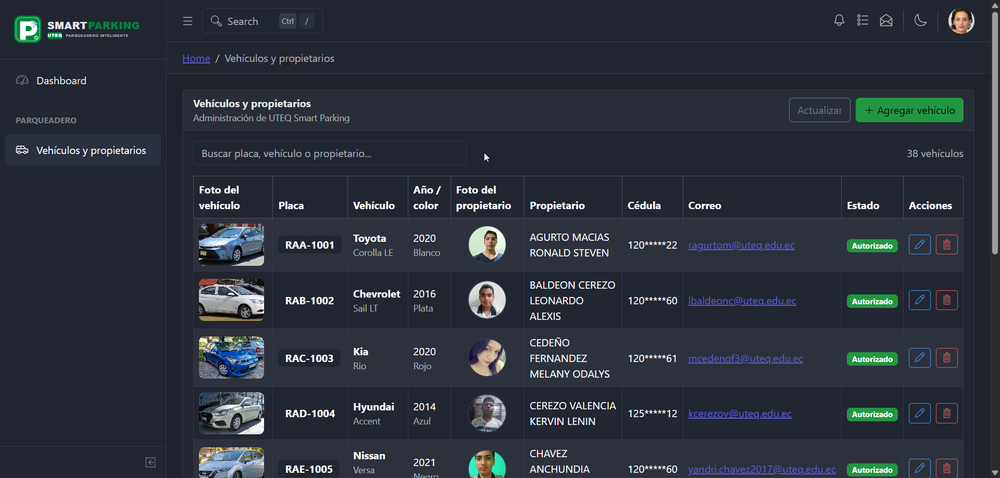

# 🅿️ UTEQ Smart Parking — Sistema de Gestión de Vehículos

<div align="center">



### Plataforma integral para la administración de vehículos y propietarios autorizados

[](https://react.dev/)
[](https://vitejs.dev/)
[](https://coreui.io/)
[](https://supabase.com/)
[](LICENSE)

</div>

---

## 📋 Descripción

**UTEQ Smart Parking** es una aplicación administrativa moderna desarrollada con **React 19**, **CoreUI 5** y **Supabase** diseñada para gestionar de forma eficiente los vehículos autorizados y datos de sus propietarios en la Universidad Técnica Estatal de Quevedo.

Esta solución implementa un **CRUD completo** con validaciones avanzadas, interfaz responsiva, manejo robusto de errores y notificaciones en tiempo real, proporcionando una experiencia de usuario profesional y segura.

### ✨ Características Principales

- 📊 **Panel de administración intuitivo** con interfaz CoreUI
- 🔄 **CRUD completo** (Crear, Leer, Actualizar, Eliminar)
- 🔍 **Búsqueda avanzada** con filtros en tiempo real
- 📱 **Diseño completamente responsivo**
- ✅ **Validaciones robustas** de datos en cliente
- 🔒 **Seguridad implementada** con RLS (Row Level Security)
- ⚡ **Indicadores de carga** durante operaciones asincrónicas
- 🎯 **Notificaciones visuales** (toast) de éxito/error
- 📧 **Gestión segura** de datos sensibles (cédula enmascarada)

---

## 📑 Tabla de contenido

- [Requisitos Previos](#requisitos-previos)
- [Instalación Rápida](#instalación-rápida)
- [Tecnologías](#tecnologías)
- [Funcionalidades Detalladas](#funcionalidades-detalladas)
- [Estructura del Proyecto](#estructura-del-proyecto)
- [Configuración de Supabase](#configuración-de-supabase-y-rls)
- [Variables de Entorno](#variables-de-entorno)
- [Validaciones del Formulario](#validaciones-del-formulario)
- [Notas de Seguridad](#notas-de-seguridad)
- [Guía de Desarrollo](#guía-de-desarrollo)
- [Licencia](#licencia)
- [Autor](#autor)

---

## 📋 Requisitos Previos

Antes de comenzar, asegúrate de tener instalado:

- **Node.js 18+** y npm
- **Git**
- Cuenta activa en [Supabase](https://supabase.com/)
- Editor de código (VS Code recomendado)

---

## 🚀 Instalación Rápida

```bash
# 1. Clonar el repositorio
git clone <URL_DE_ESTE_REPOSITORIO>
cd Parqueadero

# 2. Instalar dependencias
npm install

# 3. Crear archivo de configuración
cp .env.local.example .env.local
# Edita .env.local con tus credenciales de Supabase

# 4. Iniciar en modo desarrollo
npm run dev
```

Abre [http://localhost:5173/parqueadero/vehiculos](http://localhost:5173/parqueadero/vehiculos) en tu navegador.

---

## 🛠️ Tecnologías

## 🛠️ Tecnologías

| Tecnología | Descripción | Versión |
|:---|:---|:---:|
| **React** | Biblioteca UI declarativa | 19+ |
| **Vite** | Bundler y servidor de desarrollo ultrarápido | Latest |
| **CoreUI React** | Sistema de componentes administrativos | 5.x |
| **Supabase** | Backend con PostgreSQL y API REST | Cloud |
| **React Router** | Enrutamiento y navegación | 7.x |
| **SCSS** | Preprocesador CSS moderno | Standard |
| **Axios** (vía Supabase JS) | Cliente HTTP para API REST | - |

---

## 🎯 Funcionalidades Detalladas

### 📋 Gestión Completa (CRUD)

| Operación | Descripción | Características |
|:---|:---|:---|
| **📖 Listar** | Tabla con todos los vehículos y propietarios registrados | Foto de vehículo, foto de propietario, placa, marca, modelo, año, color, cédula enmascarada, correo, estado |
| **🔎 Buscar** | Filtro en tiempo real por múltiples campos | Placa, marca, modelo, color, propietario, correo institucional |
| **📄 Paginar** | Navegación entre registros | 10 registros por página, botones Anterior/Siguiente |
| **➕ Crear** | Registrar nuevo vehículo con validaciones | Modal interactivo con formulario validado |
| **✏️ Editar** | Modificar datos existentes | Carga automática de datos, actualización en tiempo real |
| **🗑️ Eliminar** | Borrar registro con confirmación | Modal de confirmación, eliminación segura |
| **💬 Notificaciones** | Retroalimentación visual | Toast de éxito/error, alertas inline, indicadores de carga |

### 🔒 Seguridad

- ✅ **RLS (Row Level Security)** habilitado en Supabase
- 🔐 **Cédula enmascarada** en listados (nunca se muestra completa)
- 🔑 **Claves públicas** únicamente (nunca `service_role`)
- ✔️ **Validaciones en cliente** para mejor UX
- 🛡️ **Validaciones en servidor** para integridad de datos

---

## 📁 Estructura del Proyecto

```
Parqueadero/
├── 📄 README.md                    # Este archivo
├── 📄 DEVELOPMENT.md               # Guía de desarrollo
├── 📄 ARCHITECTURE.md              # Arquitectura del proyecto
├── 📦 package.json                 # Dependencias y scripts
├── 🔧 vite.config.mjs              # Configuración de Vite
├── 🔧 eslint.config.mjs            # Configuración de ESLint
├── 🔐 .env.local.example           # Plantilla de variables de entorno
│
├── 📂 public/                      # Archivos públicos
│   └── manifest.json               # Manifest PWA
│
├── 📂 docs/                        # Documentación y assets
│   ├── image.png                   # Imagen principal
│   └── README.md                   # Docs adicionales
│
├── 📂 sql/                         # Scripts de base de datos
│   └── supabase_vehiculos_crud.sql # CRUD schema inicial
│
└── 📂 src/                         # Código fuente principal
    ├── 📄 index.jsx                # Punto de entrada
    ├── 📄 App.jsx                  # Componente raíz
    ├── 📄 routes.js                # Definición de rutas
    ├── 📄 store.js                 # Estado global
    ├── 📄 _nav.jsx                 # Configuración de navegación
    │
    ├── 📂 components/              # Componentes reutilizables
    │   ├── AppContent.jsx
    │   ├── AppHeader.jsx
    │   ├── AppSidebar.jsx
    │   ├── AppBreadcrumb.jsx
    │   ├── AppFooter.jsx
    │   └── header/
    │       └── AppHeaderDropdown.jsx
    │
    ├── 📂 hooks/                   # Custom React hooks
    │   └── useVehiculos.js         # Hook para gestión de vehículos
    │
    ├── 📂 lib/                     # Librerías y utilidades
    │   └── supabase.js             # Cliente de Supabase
    │
    ├── 📂 utils/                   # Funciones utilitarias
    │   └── validarVehiculo.js      # Validaciones de formulario
    │
    ├── 📂 assets/                  # Recursos estáticos
    │   ├── brand/                  # Logos y branding
    │   ├── icons/                  # Iconografía
    │   └── images/                 # Imágenes
    │
    ├── 📂 scss/                    # Estilos SCSS
    │   ├── style.scss              # Estilos principales
    │   ├── examples.scss           # Estilos de ejemplos
    │   └── vendors/                # Estilos de terceros
    │
    ├── 📂 layout/                  # Layouts principales
    │   └── DefaultLayout.jsx       # Layout por defecto
    │
    └── 📂 views/                   # Vistas y páginas
        ├── parqueadero/            # ⭐ Módulo de vehículos
        │   ├── ListaVehiculos.jsx  # Tabla principal
        │   ├── VehiculoFormModal.jsx # Modal de crear/editar
        │   └── ConfirmarEliminarModal.jsx # Modal de confirmación
        ├── dashboard/              # Panel de control
        ├── authentication/         # Autenticación
        ├── forms/                  # Ejemplos de formularios
        ├── components/             # Demostración de componentes
        └── ...otros módulos
```

---

## ⚙️ Configuración de Supabase y RLS

### 📋 Pasos de Configuración

#### 1️⃣ Crear Proyecto en Supabase

1. Accede a [supabase.com](https://supabase.com/)
2. Inicia sesión o crea una cuenta
3. Crea un nuevo proyecto
4. Anota tu URL y claves públicas

#### 2️⃣ Ejecutar Scripts de Base de Datos

1. Primero, ejecuta **`supabase_parqueadero_uteq.sql`** (script de la práctica base)
   - Crea tablas: `vehiculos`, `puestos`, `registros_estacionamiento`

2. Luego, ejecuta **`sql/supabase_vehiculos_crud.sql`** incluido en este repositorio:
   - ✅ Agrega columna `cedula` a tabla `vehiculos`
   - ✅ Crea `cedula_enmascarada` como columna generada
   - ✅ Habilita **RLS** en tabla `vehiculos`
   - ✅ Configura políticas `SELECT`, `INSERT`, `UPDATE`, `DELETE`

#### 3️⃣ Pasos para Ejecutar Scripts

```sql
-- En SQL Editor de Supabase → New Query
-- Copiar y ejecutar contenido de: sql/supabase_vehiculos_crud.sql
```

### 🔐 Seguridad y Políticas RLS

> ⚠️ **Nota de Seguridad**: Las políticas actuales están configuradas para el rol `anon` con fines académicos únicamente.
> 
> **En producción**, debes:
> - Implementar **Supabase Auth** para autenticación de usuarios
> - Restringir acceso por usuario o rol específico
> - Usar claves con permisos limitados
> - Validar todos los datos en el servidor

---

## 🔑 Variables de Entorno

Crea un archivo `.env.local` en la raíz del proyecto (copia desde `.env.local.example`):

```dotenv
# Supabase Configuration
VITE_SUPABASE_URL=https://your-project.supabase.co
VITE_SUPABASE_PUBLISHABLE_KEY=sb_publishable_your_key_here

# Otros (opcionales)
VITE_APP_NAME=UTEQ Smart Parking
VITE_APP_VERSION=1.0.0
```

### 📌 Variables Requeridas

| Variable | Descripción | Obligatoria |
|:---|:---|:---:|
| `VITE_SUPABASE_URL` | URL de tu proyecto Supabase | ✅ |
| `VITE_SUPABASE_PUBLISHABLE_KEY` | Clave pública (`anon`) de Supabase | ✅ |

### ⚠️ Consideraciones Importantes

- **Nunca** uses la clave `service_role` en el cliente
- El archivo `.env.local` está en `.gitignore` y no se sube al repositorio
- Copia las credenciales desde el panel de Supabase → Settings → API

---

## ✔️ Validaciones del Formulario

El sistema implementa validaciones robustas tanto en cliente como en servidor:

### 📋 Campos del Formulario

| Campo | Validaciones | Ejemplo |
|:---|:---|:---|
| **Placa** | Obligatoria, formato ecuatoriano | `ABC-1234` |
| **Marca** | Obligatoria, texto | `Toyota` |
| **Modelo** | Obligatoria, texto | `Corolla` |
| **Año** | Numérico, 1980 - (año actual + 1) | `2024` |
| **Color** | Obligatorio, texto | `Blanco` |
| **Tipo de Vehículo** | Obligatorio, selección | `Auto`, `Camión`, etc. |
| **Propietario** | Obligatorio, nombre completo | `Juan Pérez` |
| **Cédula** | 10 dígitos con verificador válido | `1234567890` |
| **Correo Institucional** | Email válido | `usuario@uteq.edu.ec` |
| **Foto Vehículo** | URL válida (opcional) | `https://...` |
| **Foto Propietario** | URL válida (opcional) | `https://...` |

### 🎯 Comportamiento de Validaciones

- ✅ **En Crear**: Todos los campos requeridos deben completarse
- ✅ **En Editar**: Cédula opcional (se conserva actual si está vacía)
- ✅ **Mensajes de Error**: Se muestran junto a cada campo
- ✅ **Alertas de Red**: Se muestran en modal si falla la conexión
- ✅ **Feedback Visual**: Campos con error resaltados en rojo

---

## 🛡️ Notas de Seguridad

### 🔐 Protección de Datos Sensibles

- 📄 **Cédula Enmascarada**: La cédula completa nunca se solicita en listados
  - Se usa columna `cedula_enmascarada` (ejemplo: `123456****`)
  - El cliente nunca recibe el valor completo
  
- ✏️ **Edición de Cédula**: 
  - Campo mostrado vacío por diseño de seguridad
  - Solo se envía a Supabase si el usuario escribe un valor nuevo
  - Permite cambiar cédula sin exponer la actual

- 🔑 **Claves Supabase**:
  - Siempre usar `publishable_key` (anon) en el cliente
  - **Nunca** incluir `service_role_key` en el frontend
  - Credenciales en `.env.local`, nunca en el código

### ✅ Validaciones Multi-Nivel

- ✔️ **Cliente**: Validaciones en tiempo real para mejor UX
- ✔️ **Servidor**: Validaciones en Supabase para integridad de datos
- ✔️ **RLS**: Políticas de Row Level Security en base de datos

### 📊 Auditoría y Cumplimiento

- 📝 Usar `created_at` y `updated_at` para auditoría
- 🔍 Implementar logs de cambios para cumplimiento
- 🔐 Cifrar datos sensibles adicionales si es necesario

---

## 📖 Guía de Desarrollo

### 🚀 Scripts Disponibles

```bash
# Modo desarrollo
npm run dev              # Inicia servidor de desarrollo (puerto 5173)

# Compilación
npm run build            # Construye para producción
npm run preview          # Previsualiza build de producción

# Linting y Formato
npm run lint             # Ejecuta ESLint
npm run lint:fix         # Corrige errores de ESLint automáticamente
```

### 📚 Estructura de Componentes

Cada componente de vistas sigue este patrón:

```jsx
// views/parqueadero/ListaVehiculos.jsx
import { useState, useEffect } from 'react'
import { useVehiculos } from '../../hooks/useVehiculos'

export default function ListaVehiculos() {
  const { vehiculos, loading, error, crear, actualizar, eliminar } = useVehiculos()
  
  // Lógica del componente
  return (
    // JSX del componente
  )
}
```

### 🔄 Flujo de Datos

```
Supabase (PostgreSQL)
    ↓
supabase.js (Cliente)
    ↓
useVehiculos.js (Hook)
    ↓
Componentes (React)
```

### 🐛 Debugging

1. **React DevTools**: Inspecciona el árbol de componentes
2. **Console del navegador**: Verifica errores de JavaScript
3. **Network tab**: Monitorea llamadas a Supabase
4. **Supabase Dashboard**: Verifica datos en la BD directamente

---

## 📦 Dependencias Principales

```json
{
  "dependencies": {
    "react": "^19.0.0",
    "@coreui/react": "^5.0.0",
    "@supabase/supabase-js": "^2.x.x",
    "react-router-dom": "^7.x.x"
  },
  "devDependencies": {
    "vite": "^5.x.x",
    "eslint": "^8.x.x",
    "sass": "^1.x.x"
  }
}
```

---

## 📄 Documentación Adicional

- 📘 [DEVELOPMENT.md](DEVELOPMENT.md) - Guía completa de desarrollo
- 🏗️ [ARCHITECTURE.md](ARCHITECTURE.md) - Detalles de arquitectura
- 📚 [React Documentation](https://react.dev/)
- 📚 [CoreUI Documentation](https://coreui.io/react/docs/)
- 📚 [Supabase Documentation](https://supabase.com/docs)

---

## 📋 Checklist de Despliegue

- [ ] Todas las validaciones funcionan correctamente
- [ ] Variables de entorno configuradas en el servidor
- [ ] CORS habilitado en Supabase
- [ ] RLS policies verificadas y probadas
- [ ] Datos sensibles no se exponen en logs
- [ ] SSL/TLS habilitado
- [ ] Backups de BD configurados
- [ ] Monitoreo y alertas activos

---

## 📄 Licencia

Este proyecto está bajo la licencia **MIT**. Ver archivo [LICENSE](LICENSE) para más detalles.

---

## 👥 Autor

**Proyecto de Práctica Académica**

Desarrollado como práctica de la asignatura:
- **Aplicaciones Telemáticas Basadas en la Web**
- Carrera: Ingeniería en Telemática
- Universidad: UTEQ (Universidad Técnica Estatal de Quevedo)

### 🤝 Contribuciones

Las contribuciones son bienvenidas. Para cambios importantes:

1. Fork el proyecto
2. Crea una rama para tu feature (`git checkout -b feature/AmazingFeature`)
3. Commit tus cambios (`git commit -m 'Add some AmazingFeature'`)
4. Push a la rama (`git push origin feature/AmazingFeature`)
5. Abre un Pull Request

---

## 📞 Soporte

Para problemas o dudas:
1. Revisa la documentación en [DEVELOPMENT.md](DEVELOPMENT.md)
2. Consulta la [ARCHITECTURE.md](ARCHITECTURE.md)
3. Abre un issue en el repositorio
4. Contacta al profesor/instructor

---

**Última actualización**: 2024
**Estado**: ✅ Activo y en desarrollo
